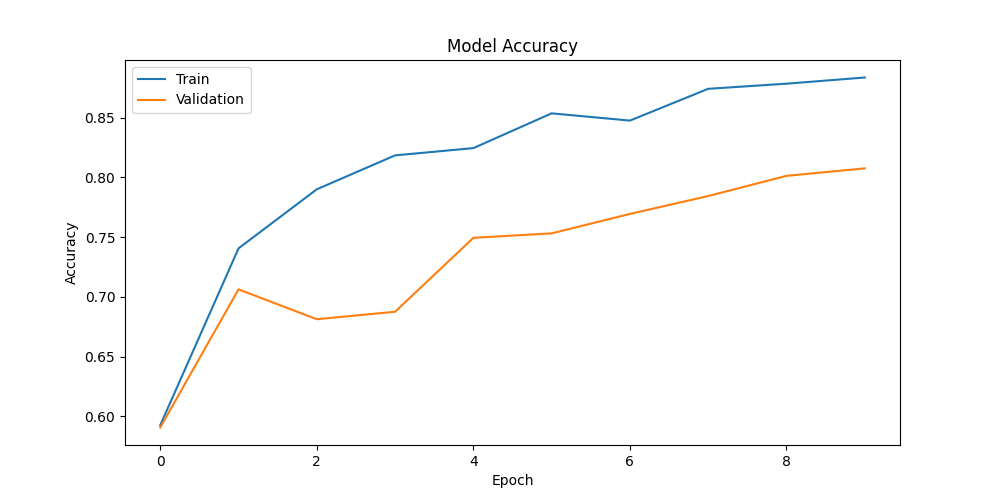
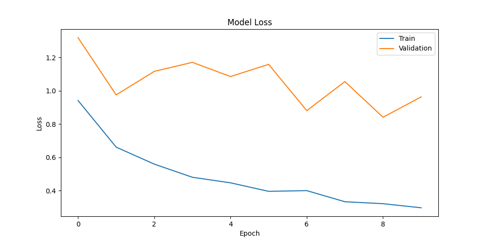

# 🧠 Brain Tumor MRI Classification using CNN

## 📌 Project Overview

This project uses a Convolutional Neural Network (CNN) built with TensorFlow and Keras to classify MRI brain scans into four categories:

- Glioma
- Meningioma
- Pituitary Tumor
- No Tumor

The model performs automated brain tumor detection from MRI images and demonstrates the application of Deep Learning in medical image analysis.

---

## 🎯 Objectives

- Classify MRI brain scans into 4 tumor categories.
- Apply image preprocessing and data augmentation techniques.
- Train a CNN model using TensorFlow/Keras.
- Evaluate model performance using accuracy and loss metrics.
- Visualize training results.

---

## 📂 Dataset

Dataset: Brain Tumor MRI Dataset

Classes:

1. Glioma
2. Meningioma
3. Pituitary
4. No Tumor

Dataset Structure:

```
Training/
├── glioma
├── meningioma
├── notumor
└── pituitary

Testing/
├── glioma
├── meningioma
├── notumor
└── pituitary
```

---

## 🛠️ Technologies Used

- Python
- TensorFlow
- Keras
- NumPy
- Matplotlib
- Kaggle Notebook
- GitHub

---

## 🏗️ CNN Architecture

```
Input Layer (128x128x3)

↓
Conv2D (32 Filters, ReLU)

↓
MaxPooling2D

↓
Conv2D (64 Filters, ReLU)

↓
MaxPooling2D

↓
Conv2D (128 Filters, ReLU)

↓
MaxPooling2D

↓
Flatten

↓
Dense (128, ReLU)

↓
Dropout (0.5)

↓
Dense (4, Softmax)
```

---

## ⚙️ Data Preprocessing

- Image Rescaling (1/255)
- Random Rotation
- Random Zoom
- Horizontal Flipping
- Image Resizing (128 × 128)

---

## 📊 Model Performance

| Metric | Value |
|----------|----------|
| Training Accuracy | 88.36% |
| Validation Accuracy | 80.75% |
| Training Loss | 0.2973 |
| Validation Loss | 0.9634 |

---

## 📈 Results

### Accuracy Graph



### Loss Graph



---

## 📁 Project Files

```
Brain-Tumor-CNN-Classification/
│
├── Brain_Tumor_CNN.ipynb
├── brain_tumor_cnn.h5
├── accuracy_graph.png
├── loss_graph.png
├── README.md
└── requirements.txt
```

---

## 🔗 Kaggle Notebook

Kaggle Implementation:

https://www.kaggle.com/code/bavatharanivethamani/brain-tumor-cnn-classification?scriptVersionId=327447073

---

## 🚀 Future Improvements

- ResNet50 Transfer Learning
- MobileNetV2 Transfer Learning
- Confusion Matrix Visualization
- Classification Report
- Grad-CAM Explainability
- Flask/Streamlit Deployment

---

## 👩‍💻 Author

**Bavatharani V**

B.Tech Information Technology

Artificial Intelligence & Machine Learning Enthusiast

GitHub Portfolio Project - 2026
